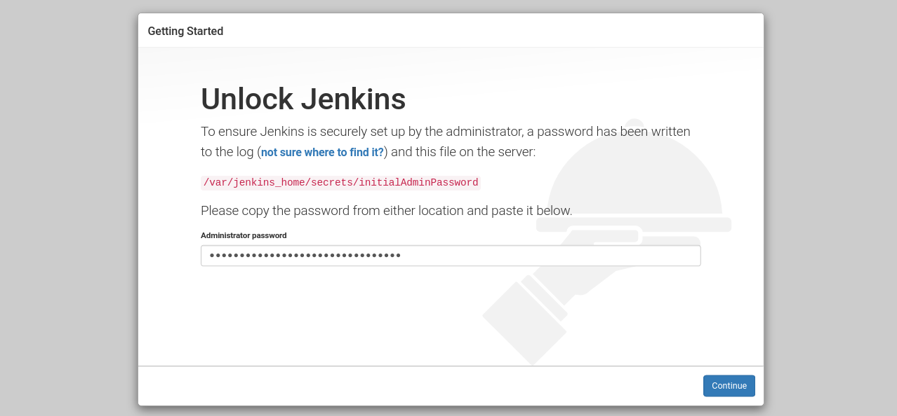
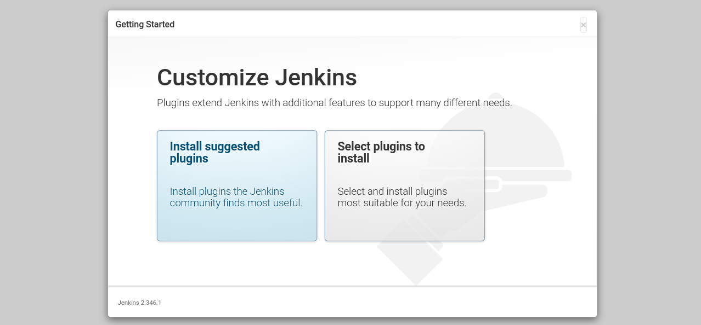
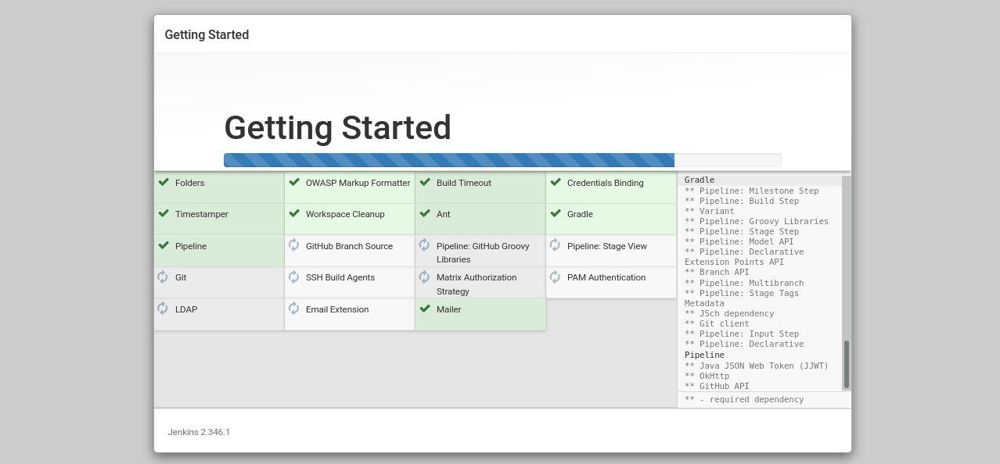
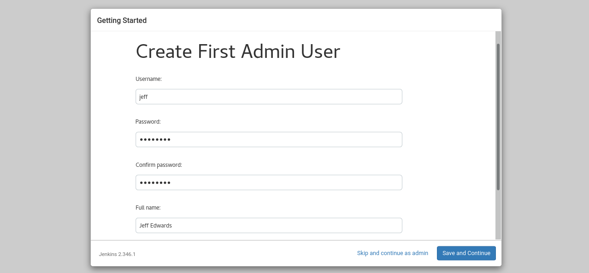
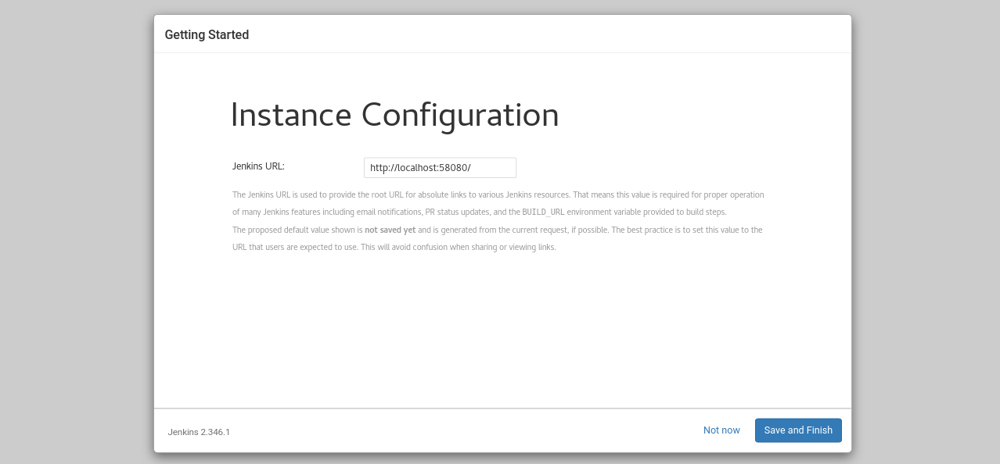
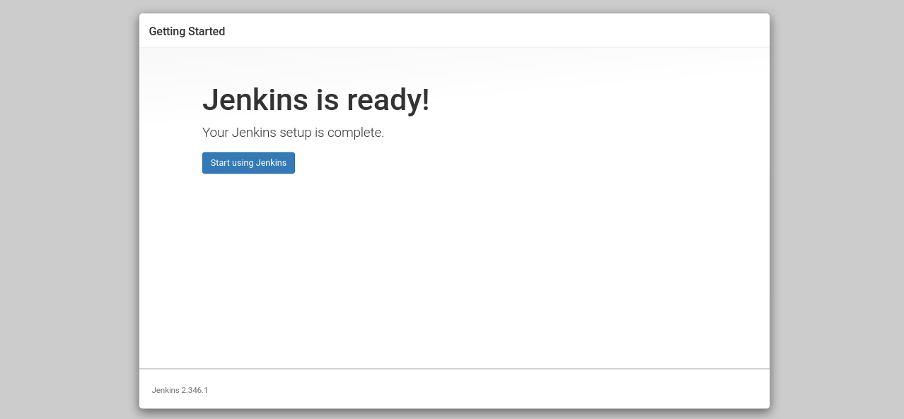

# How to install Jenkins using Docker Compose

## Configuration for Docker Compose
Create a dedicated directory for persisting Jenkins configuration and data:
```
$ mkdir -p ${HOME}/srv/jenkins
```

Define an environment variable ```JENKINS_HOME``` that references the Jenkins directory:
```
$ export JENKINS_HOME=${HOME}/srv/jenkins
```

Create a ```docker-compose.yml``` file with the following content:
```
version: '3.8'
services:
  jenkins:
    container_name: jenkins-lts
    image: jenkins/jenkins:lts
    restart: unless-stopped
    privileged: true
    user: root
    ports:
      - 58080:8080
      - 50000:50000
    volumes:
      - ${JENKINS_HOME}:/var/jenkins_home
      - /var/run/docker.sock:/var/run/docker.sock
      - /usr/bin/docker:/usr/bin/docker
```

The above configuration will allow us to create a container with the latest version of Jenkins (LTS). The most important elements of this configuration are:

- **image** – determines the image we want to use.
- **ports** – defines what ports we want to make available from the container to the outside. In our case, it will be ports 8080 (www) and 50000 (api)
- **container_name** – the name of our container
- **volumes** – these are the virtual volumes used by the container. In our case, we have a ${JENKINS_HOME} directory, which is on our system, and an additional two volumes that allow us to use Docker from Jenkins.

## Jenkins installation
The containers are started using the command:
```
$ docker compose up -d
```

Once launched, the Jenkins Docker image is downloaded and ran:
```
[+] Running 15/15
 ⠿ jenkins Pulled                       10.9s
   ⠿ 1339eaac5b67 Pull complete          5.5s
   ⠿ ee7fe1de5234 Pull complete          7.2s
   ⠿ a167e5ee9d3d Pull complete          7.4s
   ⠿ 635f2040c45d Pull complete          7.5s
   ⠿ 0de24a2d2be8 Pull complete          7.6s
   ⠿ 713854f8e14e Pull complete          8.2s
   ⠿ e7c234de7c34 Pull complete          8.3s
   ⠿ e7c993dd256d Pull complete          8.4s
   ⠿ 9418264787f2 Pull complete          9.3s
   ⠿ a42be93486cb Pull complete          9.3s
   ⠿ fba1e1892f7f Pull complete          9.4s
   ⠿ af4f2c783b33 Pull complete          9.5s
   ⠿ f7f0bf5c5bf2 Pull complete          9.6s
   ⠿ 9e8d31920a67 Pull complete          9.7s
[+] Running 2/2
 ⠿ Network jenkins_default   Created     0.3s
 ⠿ Container jenkins-lts     Started    30.7s
```

Before we go to the browser, we need to copy the administrator password that was created automatically when the server was first started. We do it with the command:
```
$ docker exec jenkins-lts cat /var/jenkins_home/secrets/initialAdminPassword
```

## Jenkins’s first run
Once we have the password, we can go to the browser. Enter http://localhost:58080/ in the URL address and the following page should appear:



Here, in the Administrator password field, enter the password that we just copied. After entering the password, we go to next page: Continue.

In the next step, we have the option to choose the add-ons that we want to install on our server. Here, I suggest using the default list of plugins by selecting the Install suggested plugins option:



After a few moments, Jenkins should install the required add-ons:



In the next step, we need to create an administrator account. After providing the required information, click Save and Continue:



The server address information will appear on the next screen. We leave the default address here and move on (Save and Finish).



Basic setup is complete!



